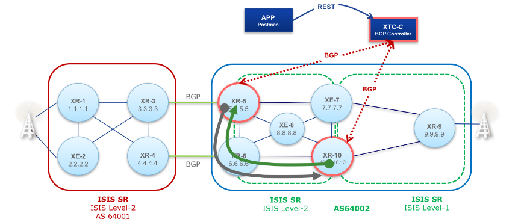

# Challenge Project Segment Routing

This documentation can be viewed with [VuePress](https://vuepress.vuejs.org) or under the [public website](https://mattbaumann.github.io/segmentRouting/).

## MPLS

The *Multi-Protocol Label Switching* protocol allows router to leverage the efficiency of switching with the feature-set of routing. MPLS is the *data plane* and uses BGP for the *control plane*(label and route distribution).

Underneath the MPLS overlay network needs to be a traditional network infrastructure. There needs to be a routing protocol and a transport protocol. This allows router that are not participating in MPLS to receive route updates. Obviously, route updates need to be transported via BGP and the traditional routing protocol.

## Segment Routing

*Segment Routing* enhances MPLS with a route controller. The controller may define MPLS routes for individual endpoints, applications, failures or priorities. Those rules are stored in the controller as *sr policy*. The controller sends BGP updates, to control the packet flows according to the policy, in real time. 

Our application is able to message with the controller over a RESTful HTTP protocol. The controller solves the real-time constraints of BGP and allows our application to focus on rule definition and analysis.